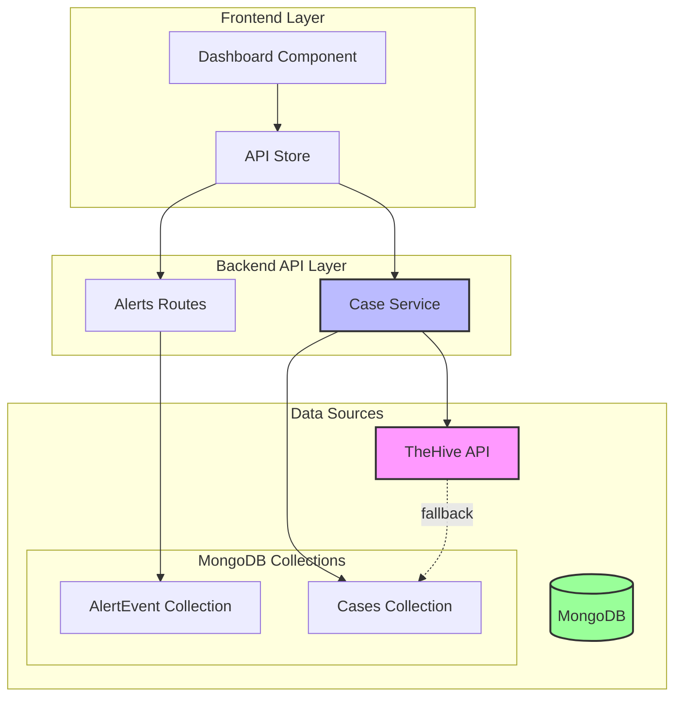
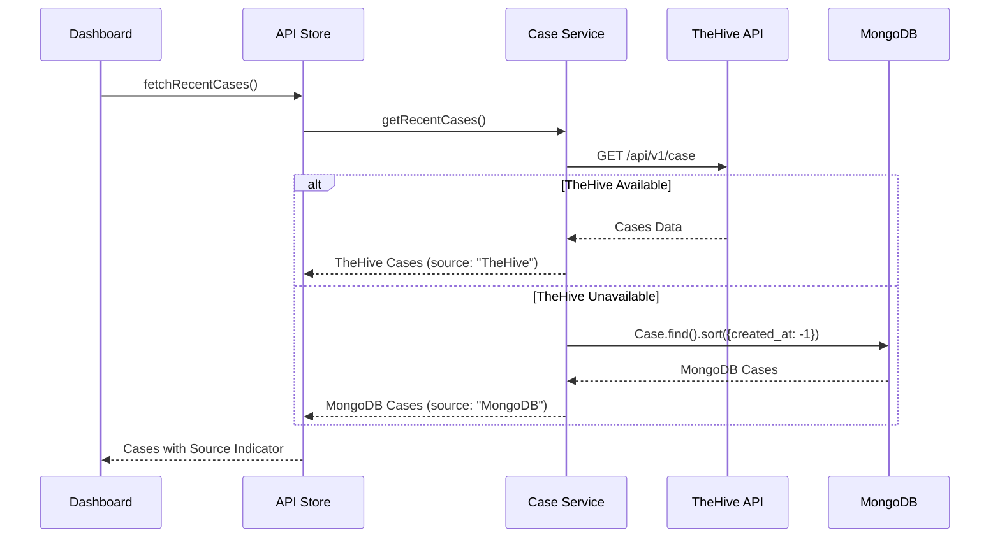
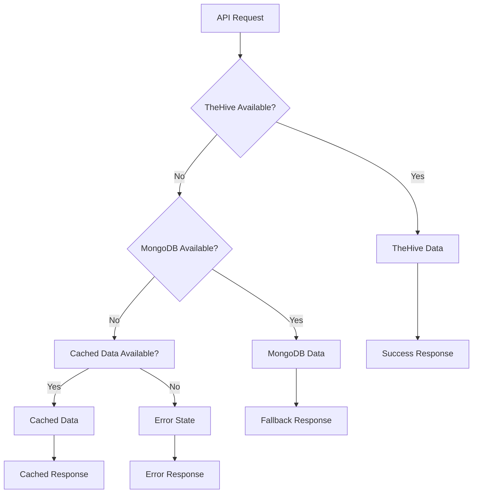

# Design Document

## Overview

This design implements a hybrid data source architecture for the SOC Dashboard, enabling seamless fallback from TheHive API to MongoDB for case management, while ensuring accurate alert storage and metrics calculation. The solution maintains data consistency across sources and provides transparent error handling.

## Architecture

### High-Level Architecture



### Data Flow Architecture



## Components and Interfaces

### 1. Enhanced Case Service

**Location:** `backend/services/caseService.js` (new file)

**Responsibilities:**
- Implement hybrid data source logic
- Handle TheHive API integration
- Manage MongoDB fallback
- Normalize data formats between sources
- Provide error handling and logging

**Interface:**
```javascript
class CaseService {
  async getRecentCases(limit = 20): Promise<Case[]>
  async getCaseById(id: string): Promise<Case | null>
  async createCase(caseData: CaseInput): Promise<Case>
  async updateCase(id: string, updates: Partial<Case>): Promise<Case>
  private async fetchFromTheHive(limit: number): Promise<Case[]>
  private async fetchFromMongoDB(limit: number): Promise<Case[]>
  private normalizeCase(rawCase: any, source: string): Case
}
```

### 2. Enhanced API Store

**Location:** `src/stores/apiStore.js` (existing file - modifications)

**New Methods:**
```javascript
// Enhanced case fetching with error handling
async fetchRecentCases(limit = 10): Promise<void>
async retryCaseFetch(): Promise<void>

// New state properties
casesLoading: Ref<boolean>
casesError: Ref<string | null>
casesSource: Ref<'TheHive' | 'MongoDB' | null>
```

### 3. Enhanced Alert Routes

**Location:** `backend/routes/alerts.js` (existing file - modifications)

**Enhanced Endpoints:**
- `GET /api/alerts/metrics` - Improved MongoDB-based metrics calculation
- `POST /api/alerts/events` - Enhanced alert storage validation
- `GET /api/alerts/cases/recent` - New hybrid case endpoint

### 4. Dashboard Component Updates

**Location:** `src/pages/DashboardNew.vue` (existing file - modifications)

**Enhancements:**
- Data source indicator display
- Enhanced error handling UI
- Retry mechanisms for failed requests
- Loading state improvements

## Data Models

### Normalized Case Model

```typescript
interface Case {
  id: string
  title: string
  description: string
  severity: number // 1-4 (Low to Critical)
  status: 'Open' | 'InProgress' | 'Resolved' | 'Closed'
  owner: string
  source: 'TheHive' | 'MongoDB'
  tags: string[]
  artifacts: Artifact[]
  createdAt: Date
  updatedAt: Date
  created_by: string
  
  // Source-specific fields (optional)
  thehive_id?: string
  _id?: string
}
```

### Enhanced AlertEvent Model

```typescript
interface AlertEvent {
  _id: string
  rule_id?: string
  log_id?: string
  severity: 'Critical' | 'High' | 'Medium' | 'Low'
  title: string
  description: string
  source_ip?: string
  dest_ip?: string
  created_by: string
  read: boolean
  acknowledged: boolean
  created_at: Date
  metadata?: any
  analysis_status: 'pending' | 'running' | 'completed' | 'error'
}
```

## Implementation Strategy

### Phase 1: Backend Service Layer

1. **Create CaseService** (`backend/services/caseService.js`)
   - Implement hybrid data source logic
   - Add TheHive API client with timeout handling
   - Add MongoDB query methods
   - Implement data normalization

2. **Enhance Alert Storage** (`backend/routes/alerts.js`)
   - Improve alert creation validation
   - Add MongoDB storage confirmation
   - Enhance metrics calculation accuracy

### Phase 2: API Integration

1. **Update API Store** (`src/stores/apiStore.js`)
   - Add enhanced error handling
   - Implement retry mechanisms
   - Add data source tracking
   - Improve loading states

2. **Create New API Endpoints**
   - `/api/cases/recent` - Hybrid case endpoint
   - `/api/alerts/metrics/detailed` - Enhanced metrics

### Phase 3: Frontend Updates

1. **Dashboard Component** (`src/pages/DashboardNew.vue`)
   - Add data source indicators
   - Enhance error display
   - Add retry buttons
   - Improve loading states

2. **Case Display Enhancements**
   - Source badges
   - Error state handling
   - Retry mechanisms

## Error Handling

### Error Hierarchy



### Error Types and Handling

1. **TheHive API Errors**
   - Network timeout: Fallback to MongoDB
   - Authentication failure: Log error, fallback to MongoDB
   - Rate limiting: Implement exponential backoff

2. **MongoDB Errors**
   - Connection failure: Use cached data if available
   - Query timeout: Return partial results
   - Collection not found: Create sample data

3. **Data Consistency Errors**
   - Field mapping failures: Use default values
   - Type conversion errors: Log and skip invalid records
   - Missing required fields: Apply defaults

## Testing Strategy

### Unit Tests

1. **CaseService Tests**
   - Test TheHive API integration
   - Test MongoDB fallback logic
   - Test data normalization
   - Test error handling scenarios

2. **API Store Tests**
   - Test state management
   - Test error handling
   - Test retry mechanisms

### Integration Tests

1. **End-to-End Case Flow**
   - Test complete case retrieval flow
   - Test fallback scenarios
   - Test error recovery

2. **Alert Storage Tests**
   - Test alert creation and storage
   - Test metrics calculation accuracy
   - Test concurrent alert handling

### Property-Based Tests

Property tests will be implemented for data normalization and error handling scenarios to ensure robustness across various input conditions.

## Correctness Properties

*A property is a characteristic or behavior that should hold true across all valid executions of a system-essentially, a formal statement about what the system should do. Properties serve as the bridge between human-readable specifications and machine-verifiable correctness guarantees.*

### Property 1: Fallback Mechanism Consistency
*For any* case retrieval request, when TheHive API is unavailable or returns empty results, the system should automatically query MongoDB and return cases with source indicator "MongoDB"
**Validates: Requirements 1.1, 1.5**

### Property 2: Data Source Indication
*For any* case retrieved from MongoDB, the case object should have source field set to "MongoDB"
**Validates: Requirements 1.2**

### Property 3: Data Normalization Consistency
*For any* case from TheHive or MongoDB sources, the normalized case object should have consistent field names (id, createdAt, severity) regardless of the original source format
**Validates: Requirements 1.4, 6.1, 6.2, 6.4, 6.5**

### Property 4: MongoDB Alert Persistence
*For any* alert creation or update operation, the alert data should be immediately stored in MongoDB AlertEvent collection with all required fields populated
**Validates: Requirements 2.1, 2.3, 2.5**

### Property 5: Alert Metrics Accuracy
*For any* MongoDB AlertEvent collection state, the dashboard metrics (total alerts, critical alerts, case counts) should exactly match the actual counts from MongoDB queries
**Validates: Requirements 2.2, 4.1, 4.2, 4.3**

### Property 6: Alert Status Persistence
*For any* alert status change (read/unread, acknowledged), the updated status should be immediately persisted in MongoDB
**Validates: Requirements 2.4**

### Property 7: Error Handling Independence
*For any* data source error (TheHive timeout, MongoDB connection failure), the system should handle the error appropriately without affecting the other data source operations
**Validates: Requirements 3.2**

### Property 8: Fallback Logging
*For any* data source fallback operation (TheHive to MongoDB), the system should create a log entry documenting the fallback event
**Validates: Requirements 3.3, 5.1**

### Property 9: Data Source Indicator Display
*For any* case displayed in the dashboard UI, the case should include a visible data source indicator matching its actual source
**Validates: Requirements 3.4**

### Property 10: Response Caching Behavior
*For any* successful data source response, subsequent identical requests within the cache timeout period should return cached data without making new API calls
**Validates: Requirements 3.5**

### Property 11: Metrics Refresh Accuracy
*For any* dashboard metrics refresh operation, the displayed metrics should reflect the most current MongoDB data state
**Validates: Requirements 4.4**

### Property 12: Concurrent Alert Handling
*For any* set of concurrent alert creation operations, the final alert count should equal the number of successfully created alerts without data loss
**Validates: Requirements 4.5**

### Property 13: Cache Fallback Behavior
*For any* MongoDB unavailability scenario, if cached data exists, the system should display cached data instead of error messages
**Validates: Requirements 5.2**

### Property 14: API Retry Mechanism
*For any* failed API call, the system should attempt retry operations according to the configured retry policy before declaring failure
**Validates: Requirements 5.3**

### Property 15: Service Recovery Behavior
*For any* data source that becomes available after being unavailable, the system should automatically resume using that data source for subsequent requests
**Validates: Requirements 5.5**

### Property 16: Metadata Preservation
*For any* case data switching between sources during fallback operations, the case metadata should be preserved without loss
**Validates: Requirements 6.3**

## Testing Strategy

### Dual Testing Approach

This feature will use both unit tests and property-based tests to ensure comprehensive coverage:

**Unit Tests** will verify:
- Specific error scenarios (both data sources unavailable)
- Integration points between components
- Edge cases in data normalization
- Specific API endpoint behaviors

**Property-Based Tests** will verify:
- Universal properties across all input variations
- Data consistency across different source combinations
- Fallback behavior under various failure conditions
- Metrics accuracy across different data states

### Property-Based Testing Configuration

- **Testing Framework**: Jest with fast-check for JavaScript property-based testing
- **Minimum Iterations**: 100 iterations per property test
- **Test Tagging**: Each property test will reference its design document property
- **Tag Format**: **Feature: dashboard-mongodb-integration, Property {number}: {property_text}**

### Test Data Generation

**Smart Generators** will be implemented for:
- Case objects with varying field formats (TheHive vs MongoDB)
- Alert events with different severity levels and metadata
- API response scenarios (success, failure, timeout, empty)
- Concurrent operation scenarios for race condition testing

### Error Simulation

Property tests will include generators for:
- Network timeout scenarios
- Authentication failures
- Database connection issues
- Malformed API responses
- Concurrent access patterns

The testing strategy ensures that the hybrid data source architecture maintains reliability and consistency across all operational scenarios.